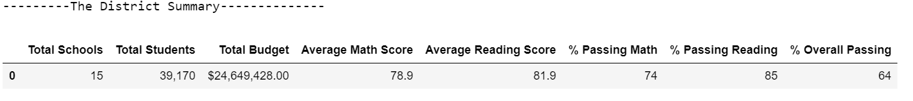

# School_District_Analysis
## Overview
Maria and her supervisor have been tasked to perform analysis on students' math and reading scores across all high schools in the district. They are provided with two files: [students_complete.csv](resources/students_complete.csv) and [schools_complete.csv](resources/schools_complete.csv).

As they were about to submit their report, they are informed that 'Thomas High School' 9th grade reading and math scores may have been altered and hence should not considered in the analysis. So they are instructed to replace Thomas High School's 9th grade scores as NaN and redo their analysis.

The results and summary below describes how replacing Thomas High School 9th grade scores with NaN affected the school district analysis.

## Results
- How is the district summary affected?
  
  The district summary originally looked like:
  

  Once, the Thomas High school 9th grade scores were replaced with NaN, the district summary looks like:
  

  **So, we see that the Percentage of students passing Math, Reading and Overall pass percentage decreased by 1 point. 
  However, the average Math score only varies slightly (0.1) and there was no change in average reading score.**

- How is the school summary affected?
  
  The school summary originally looked like:
  

  After the Thomas High School 9th grade scores were replaced with NaN, the school summary looks like:
  

  Let's look at Thomas High School numbers:

  |Parameter  | Original  | Updated |
  |:----------|:---------:|--------:|
  |Average Math Score|83.4|83.4|
  |Average Reading Score|83.8|83.9|
  |% Passing Math|93|67|
  |% Passing Reading|97|70|
  |% Overall Passing|91|65|

  **From the above numbers, we can conclude that there wasn't much change in average Math and Reading score. However, the Percentage passing in Math and Reading and Overall Passing reduced significantly.**

- How does replacing the ninth graders’ math and reading scores affect Thomas High School’s performance relative to the other schools?
  
  Let's look at how Thomas High School ranked before the changes were done:
  
  
  And the school rankings after the changes:
  

  **Looks like after the 9th grade math and reading scores were replaced with NaN, Thomas High School lost its ranking in the top 5 performing schools.** 

  **Since, the overall passing percentage for Thomas High School is 65, it ranks somewhere in the middle in the school rankings.**

- How does replacing the ninth-grade scores affect the following:
    - Math and reading scores by grade
  

         Grade Wise Math Score before the changes:

         
         
         Grade Wise Math Score after the changes:

         

        **The Thomas High School 9th grade average for math is calculated as NaN. Not much changes are observed in grade averages.**

         Grade Wise Reading Score before the changes:

         

         Grade Wise Reading Score after the changes:

         
         

        **The Thomas High School 9th grade average for reading is calculated as NaN. Not much changes are observed in grade averages.**

    - Scores by school spending
        
        Scores by school spending before the change:

        

        Scores by school spending after the change:

        

        
        The reading and overall passing percentage **decreased by 7 points**, math percentage **decreased by 6 points** for schools that spent $630 to $644 per student**

    - Scores by school size
        
        Scores by school size before the change:
        
        Scores by school size after the change:
        
        
        The reading, math and overall passing percentage **decreased by 6 points** for schools with **student population of 1000 to 2000**. It makes sense as Thomas High School student count of 1635 falls in this range.

    - Scores by school type
        
        Scores by school type before the change:
        
        Scores by school type after the change:
        
        
        The reading, math percentages **decreased by 4 points** and overall passing percentage **decreased by 3 points** for **Charter schools** as Thomas High School is categorized as 'Charter' school.

## Summary
From all the above results we can summarize that **replacing Thomas High School's ninth grade score with NaN**:

1. Does not have impact on average math and reading scores for Charter schools, schools with per student spending of $630 to $644 and school size of 1000 - 2000. 
2. However, the passing percentage of math and  reading and overall passing is decreased for above mentioned categories.
3. Thomas High School lost its ranking in the 5 top performing school.
4. At district level the average math score dipped by 0.1 point. Average reading score didn't have any impact.
   

